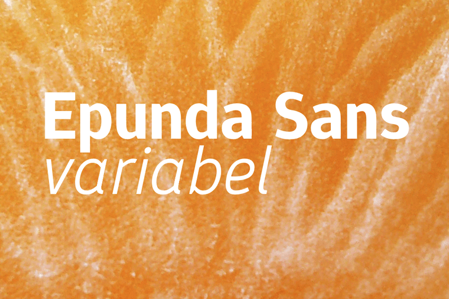

----

# Epunda Sans

[![][Fontbakery]](https://googlefonts.github.io/googlefonts-project-template/fontbakery/fontbakery-report.html)
[![][Universal]](https://googlefonts.github.io/googlefonts-project-template/fontbakery/fontbakery-report.html)
[![][GF Profile]](https://googlefonts.github.io/googlefonts-project-template/fontbakery/fontbakery-report.html)
[![][Shaping]](https://googlefonts.github.io/googlefonts-project-template/fontbakery/fontbakery-report.html)

[Fontbakery]: https://img.shields.io/endpoint?url=https%3A%2F%2Fraw.githubusercontent.com%2Fgooglefonts%2Fgooglefonts-project-template%2Fgh-pages%2Fbadges%2Foverall.json
[GF Profile]: https://img.shields.io/endpoint?url=https%3A%2F%2Fraw.githubusercontent.com%2Fgooglefonts%2Fgooglefonts-project-template%2Fgh-pages%2Fbadges%2FGoogleFonts.json
[Outline Correctness]: https://img.shields.io/endpoint?url=https%3A%2F%2Fraw.githubusercontent.com%2Fgooglefonts%2Fgooglefonts-project-template%2Fgh-pages%2Fbadges%2FOutlineCorrectnessChecks.json
[Shaping]: https://img.shields.io/endpoint?url=https%3A%2F%2Fraw.githubusercontent.com%2Fgooglefonts%2Fgooglefonts-project-template%2Fgh-pages%2Fbadges%2FShapingChecks.json
[Universal]: https://img.shields.io/endpoint?url=https%3A%2F%2Fraw.githubusercontent.com%2Fgooglefonts%2Fgooglefonts-project-template%2Fgh-pages%2Fbadges%2FUniversal.json

Epunda Sans is a simple sans serif font. Its characteristic features are its slanted indentations. It is an unadorned but friendly font that remains easy to read even at small font sizes and on screens thanks to its high x-height and large interior spaces.
Epundas Sans is a variable font with a weight axis that ranges from Light (300) to Black (900).

## About

typofactur is a German foundry run by the graphic designer Simon Atzbach.

## Building

Fonts are built automatically by GitHub Actions - take a look in the "Actions" tab for the latest build.

If you want to build fonts manually on your own computer:

* `make build` will produce font files.
* `make test` will run [FontBakery](https://github.com/googlefonts/fontbakery)'s quality assurance tests.
* `make proof` will generate HTML proof files.

The proof files and QA tests are also available automatically via GitHub Actions - look at `https://yourname.github.io/your-font-repository-name`.

## Changelog

**30 Nov 2024. Version 2.001**
- Initial release

## License

This Font Software is licensed under the SIL Open Font License, Version 1.1.
This license is available with a FAQ at https://openfontlicense.org

## Repository Layout

This font repository structure is inspired by [Unified Font Repository v0.3](https://github.com/unified-font-repository/Unified-Font-Repository), modified for the Google Fonts workflow.
